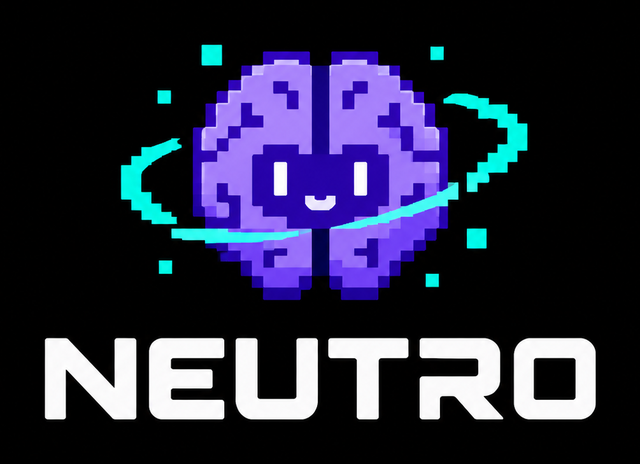

<p align="center"></p>

# Neutro

**Un cerebro para agentes y personajes que aprenden solos de lo que sienten.**

Neutro no necesita millones de ejemplos ni una red neuronal. Le das tres cosas —cómo está su cuerpo, qué tiene
alrededor y qué puede hacer— y aprende mientras vive: qué alivia el hambre, qué le hace daño, de qué conviene huir.
Se puede leer lo que piensa en cada momento y por qué.

Está inspirado en las **neuronas de concepto** que descubrió Rodrigo Quian Quiroga: neuronas que no guardan detalles,
sino ideas («lobo cerca», «hambre»). Cada concepto aprende qué hacer, y lo aprendido en una situación pasa a las
parecidas.

**▶ Pruébalo en el navegador: [emicaim.github.io/PUBLIC-NEUTRO](https://emicaim.github.io/PUBLIC-NEUTRO/)** — Neutro Minds, un mundo con miles de mentes que aprenden solas.

[English version](README.en.md)

## Neutro en acción

- **[HER](https://foko-games.itch.io/her)** (itch.io, gratis en el navegador): un juego de plataformas en el que, en el modo
  CANON, **juega Neutro** y ves su cerebro en vivo —qué ve, qué quiere, qué hace y de dónde sale cada decisión—. Se
  equivoca, muere y aprende mientras lo miras.
- **[Neutro Minds](https://emicaim.github.io/PUBLIC-NEUTRO/demo/minds/)**: un mundo con miles de mentes, cada una con su
  propio cerebro de Neutro, que forman pueblos, inventan, comercian y se pelean sin que nadie les diga cómo.

## Qué lo hace distinto

- **Aprende en vivo**, sin entrenamiento previo: de cada alivio y de cada malestar del cuerpo (recompensa homeostática,
  Keramati y Gutkin 2014).
- **Se puede leer**: cada decisión tiene una neurona, un concepto y una historia (qué fallos y aciertos la formaron).
- **Diminuto**: sin dependencias, unos pocos KB de memoria por agente. Miles de agentes a la vez en un navegador.
- **El mismo cerebro en tres lenguajes** —C# (Unity), JavaScript y Python— que deciden **exactamente** lo mismo;
  las pruebas cruzadas lo comprueban.
- **Medido con honestidad**: lo que sabe hacer y lo que no está en [docs/RESULTADOS.md](docs/RESULTADOS.md).

## Prueba en un minuto

```bash
node ejemplos/minimo.mjs        # o:  python ejemplos/minimo.py
```

Una criatura con hambre y un lobo. Nadie le dice qué hacer:

```
pasos 1-500: 32 mordiscos, 51 comidas
...
pasos 2501-3000: 3 mordiscos, 54 comidas

Lo que ha aprendido:
  lobo cerca -> huir
  hambre -> comer
```

Y el agente general en un bosque (frutales, un lobo que caza de noche, una cueva), comparado con el azar:

```bash
dotnet run --project csharp/Neutro.Ejemplos -c Release -- 10 30 --oraculos
```

## Instalar

| Dónde | Cómo |
|---|---|
| **Unity** | Package Manager → *Add package from git URL* → `https://github.com/emicaim/PUBLIC-NEUTRO.git?path=/csharp/Neutro.Nucleo` |
| **.NET** | copia `csharp/Neutro.Nucleo` o referencia su `.csproj` (.NET Standard 2.1) |
| **JavaScript** | `import { Nucleo } from './js/index.js'` (navegador o Node, módulos ES) |
| **Python** | `pip install ./python` y `from neutro import Nucleo` |

Guía paso a paso, con el agente general para juegos: [docs/INTEGRAR.md](docs/INTEGRAR.md).

## Las piezas

| Pieza | Qué hace | Dónde |
|---|---|---|
| **Núcleo** | neuronas de concepto: decide una acción por situación y aprende de fracasos y éxitos; miedo por concepto, instinto aprendido, metas, decepción, repaso | C#, JS, Python |
| **Memoria de sucesos** | qué suele venir después de qué, cuánto tarda y cuánto alivio o daño trae; deduce relaciones (A→B→C) | C#, JS, Python |
| **Agente general** | el cerebro listo para cualquier mundo: solo necesita el cuerpo, lo que ve y sus acciones; arma su percepción solo | C# |

Cómo funciona por dentro: [docs/COMO-FUNCIONA.md](docs/COMO-FUNCIONA.md). Cada número del cerebro y su justificación:
[docs/PARAMETROS.md](docs/PARAMETROS.md).

## Comprobar que los tres núcleos son idénticos

```bash
python pruebas/cruzado.py > p.txt
node pruebas/cruzado.mjs > j.txt
dotnet run --project csharp/Neutro.Pruebas -c Release > c.txt
python pruebas/comparar.py p.txt j.txt && python pruebas/comparar.py p.txt c.txt
```

## Licencia y crédito

Apache 2.0. Puedes usar Neutro gratis, también en proyectos comerciales. Si lo redistribuyes o lo incluyes en tu
juego o programa, **conserva el fichero [NOTICE](NOTICE)** y menciona a **FOKO SOFT (Emilio Martinez)** en los créditos.
Para citarlo en un trabajo académico: [CITATION.cff](CITATION.cff).

Copyright 2026 FOKO SOFT (Emilio Martinez).
